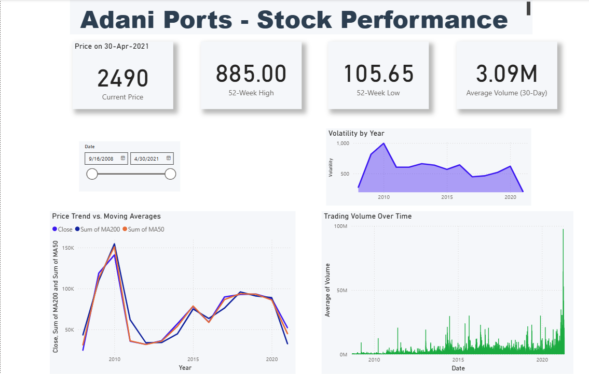

# Adani Ports Stock Performance Analysis (2007-2021)

## Dashboard

## Project Overview

This project performs a comprehensive analysis of the historical stock performance of Adani Ports and Special Economic Zone Ltd. (ADANIPORTS) from late 2007 to April 2021. The entire data analysis pipeline is covered, starting from data cleaning and feature engineering in Python to building an interactive and insightful dashboard in Power BI.

## Dashboard

## Tech Stack

* **Python:** For data cleaning, processing, and feature engineering.
    * **Libraries:** Pandas, Matplotlib, Seaborn
* **Power BI:** For creating the final interactive dashboard and visualizations.
* **DAX:** For creating custom measures and calculations within Power BI.

## Project Workflow

1.  **Data Loading:** The initial stock data for Adani Ports was loaded from a CSV file.
2.  **Data Cleaning (Python):**
    * Selected only essential columns (`Date`, `Open`, `High`, `Low`, `Close`, `Volume`).
    * Converted the `Date` column to the correct datetime format.
    * Set the `Date` column as the index for time-series analysis.
3.  **Feature Engineering (Python):**
    * Created new columns for key financial metrics:
        * **Daily Returns:** The percentage change in price day-over-day.
        * **50-Day Moving Average (MA50):** To identify short-to-medium term trends.
        * **200-Day Moving Average (MA200):** To identify long-term trends.
        * **Volatility:** The 50-day rolling standard deviation of daily returns, used as a measure of risk.
4.  **Data Export:** The cleaned and enriched dataset was exported to a new CSV file (`ADANIPORTS_Analyzed.csv`), which serves as the data source for the Power BI dashboard.
5.  **Dashboarding (Power BI):**
    * Connected to the cleaned CSV file.
    * Developed an interactive dashboard featuring dynamic KPIs, date slicers, and multiple charts to visualize performance, trends, volume, and volatility.

## Key Insights

* **Increased Trading Activity:** Trading volume has significantly increased in recent years (2020-2021), pointing to a surge in investor interest.
* **Periods of High Volatility:** The stock experienced its highest volatility during its early years (coinciding with the 2008 financial crisis) and has seen volatility rise again in the most recent period.
* **Trend Confirmation:** The dashboard clearly visualizes key trading signals, such as "Golden Crosses" (MA50 crossing above MA200), which preceded significant upward price movements.

## How to Use

1.  Clone the repository.
2.  Run the Python script (`stock_analysis.py`) to generate the `ADANIPORTS_Analyzed.csv` file.
3.  Open the Power BI file (`Adani_Ports_Dashboard.pbix`).
4.  If prompted, connect the dashboard to the newly generated `ADANIPORTS_Analyzed.csv` file.# Adani-Ports-Stock-Performance-Analysis-2007-2021-

